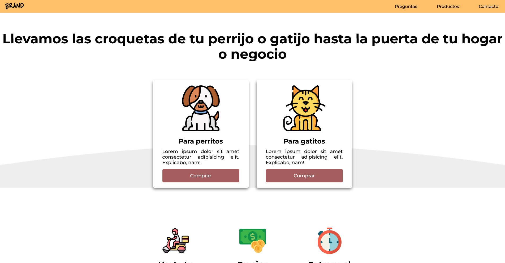

# BRAND landing page

A website for a business dedicated to selling pet food online

---

## Screenshots

---

## Live Demo

- Live Site: https://devnielote.github.io/pet-food-web/

---

## Project Purpose

I built this project with goal of practicing and learning:

- CSS animations using keyframes and smooth transitions
- Responsive layouts using CSS Grid and Flexbox for multiple screen sizes
- Managing colors and design consistency with CSS variables
- Creating modular and reusable UI components with clean styles
- Typography setup for scalable and readable content

---

## Built with

- Semantic HTML5 markup
- CSS custom properties
- CSS Grid and flexbox
- Mobile-first workflow

---

# Author

- Well...me
